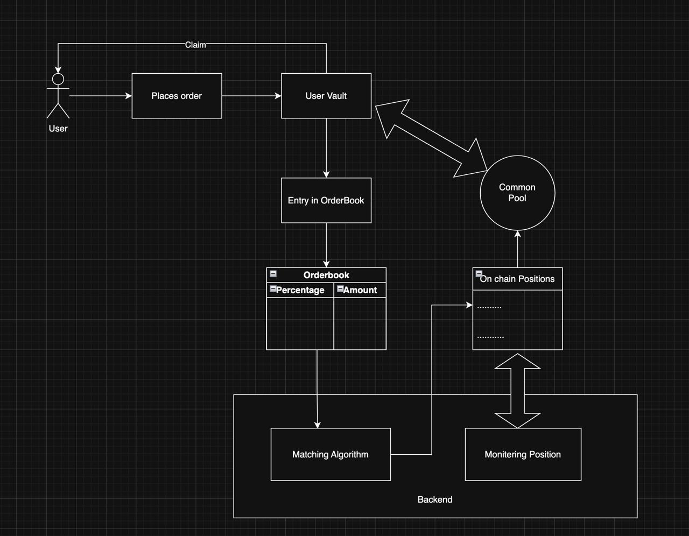

# Bound Market

Bet Range Bound Volatility on Crypto Markets

## Project Overview

Bound Market enables users to bet on volatility movements of crypto markets for certain time durations. The platform allows users to place orders for two position types:

1. **STAY_IN**: Bet on price will remain within specified bounds for 24 hours
2. **BREAKOUT**: Bet on price will break out of specified bounds within 24 hours

The platform is built on Solana for high-speed, low-cost trading with real-time price data from Pyth Network.

## Platform Architecture

The project consists of three main components:

### 1. Smart Contract

Located in the `/contract` directory, the Solana program handles:
- User vault management for deposits and withdrawals
- Position creation with price bounds
- Price monitoring with Pyth Network
- Automatic settlement and payout calculations
- Trading pool management

[View Contract Documentation](./contract/README.md)

### 2. Backend Service

Located in the `/backend` directory, the Node.js microservice manages:
- Order matching for binary options trading
- Position monitoring for settlement
- BTC price feed integration
- Database synchronization with on-chain data
- Health monitoring for the platform

[View Backend Documentation](./backend/README.md)

### 3. Frontend Application

Located in the `/frontend` directory, the Next.js web application provides:
- Real-time BTC price charts with bound visualization
- Order book for viewing market activity
- Position management interface
- Wallet integration with Solana
- Responsive design for all devices

[View Frontend Documentation](./frontend/README.md)

## How It Works

1. **User Flow**:
   - User connects their Solana wallet to the platform
   - User places an order (STAY_IN or BREAKOUT) with specified amount and price range
   - Backend matches the order with a counterparty
   - Smart contract creates positions for matched orders
   - Position monitor tracks price movements
   - Positions settle automatically when conditions are met
   - Users can claim their payouts for settled positions

2. **Integration**:
   - Backend connects to the smart contract via Anchor framework
   - Frontend communicates with backend for order placement and data retrieval
   - All components use Supabase for persistent data storage
   - Pyth Network provides reliable BTC price feeds

3. **Settlement Logic**:
   - STAY_IN positions win if price stays within bounds for 24 hours
   - BREAKOUT positions win if price breaks out of bounds at any time
   - Payouts are time-weighted, meaning they vary based on when settlement occurs
   - Maximum payout is 2x the position amount (100% profit)

## Development Setup

See individual component READMEs for detailed setup instructions:

- [Contract Setup](./contract/README.md#development-setup)
- [Backend Setup](./backend/README.md#setup)
- [Frontend Setup](./frontend/README.md#setup)

## Deployment

The platform is designed for deployment across multiple environments:

- **Smart Contract**: Deployed on Solana DevNet
- **Backend**: Containerized for deployment to any cloud provider
- **Frontend**: Optimized for deployment on Vercel

## Security

- All user funds are secured in PDAs on the Solana blockchain
- Price feed data is sourced from Pyth Network, a leading oracle solution
- Time-based calculations use Solana's on-chain clock for accuracy
- Positions can only be claimed by their original creator
